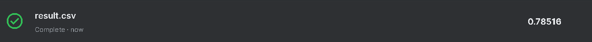

# Natural Language Processing with Disaster Tweets

## Introduction

The project aimed to predict which tweet is about a real disaster and which is not. The dataset was taken from [Kaggle](https://www.kaggle.com/c/nlp-getting-started/overview).

## Model Evaluation

The model got 0.78 on the public leaderboard.

